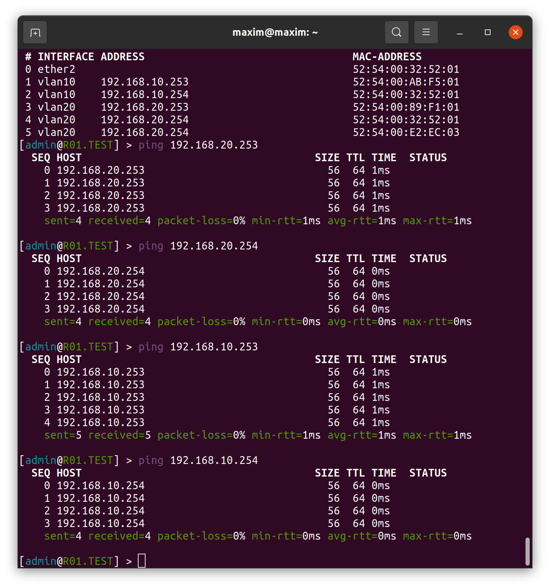

### University: [ITMO University](https://itmo.ru/ru/)

#### Faculty: [FICT](https://fict.itmo.ru)

#### Course: [Introduction in routing](https://github.com/itmo-ict-faculty/introduction-in-routing)

##### Year: 2022/2023

##### Group: K33202

##### Author: Konovalenko Maxim Pavlovich

##### Lab: Lab1

##### Date of create: 02.10.2022

##### Date of finished: 21.10.2022

***

# Отчёт по лабораторной работе №1 "Установка ContainerLab и развертывание тестовой сети связи"

**Цель работы:** научиться использовать containerlab, получение практических навыков в настройке сети с VLAN'ами и методами работы с ними.

**Результаты работы:**

#### 1. Схема настраеваемой сети


#### 2. Файл для развертывания тестовой сети yaml

```
name: lab1

mgmt:
  network: statics
  ipv4_subnet: 172.20.20.0/24

topology:
  nodes:
    R01.TEST:
      kind: vr-ros
      mgmt_ipv4: 172.20.20.21
      image: vrnetlab/vr-routeros:6.47.9

    SW01.L3.01.TEST:
      kind: vr-ros
      mgmt_ipv4: 172.20.20.22
      image: vrnetlab/vr-routeros:6.47.9

    SW02.L3.01.TEST:
      kind: vr-ros
      mgmt_ipv4: 172.20.20.23
      image: vrnetlab/vr-routeros:6.47.9

    SW02.L3.02.TEST:
      kind: vr-ros
      mgmt_ipv4: 172.20.20.24
      image: vrnetlab/vr-routeros:6.47.9

    PC1:
      kind: linux
      mgmt_ipv4: 172.20.20.25
      image: travelping/nettools:latest

    PC2:
      kind: linux
      mgmt_ipv4: 172.20.20.26
      image: travelping/nettools:latest
  
  links:
    - endpoints: ["R01.TEST:eth1","SW01.L3.01.TEST:eth1"]
    - endpoints: ["SW01.L3.01.TEST:eth2","SW02.L3.01.TEST:eth1"]
    - endpoints: ["SW01.L3.01.TEST:eth3","SW02.L3.02.TEST:eth1"]
    - endpoints: ["SW02.L3.01.TEST:eth2","PC1:eth1"]
    - endpoints: ["SW02.L3.02.TEST:eth2","PC2:eth1"]
```

#### 3. Тексты конфигурация для каждого сетевого устройства

**Router**


**Switch01.L3.01**


**Switch02.L3.01**


**Switch02.L3.02**


#### 4. Результаты пингов


