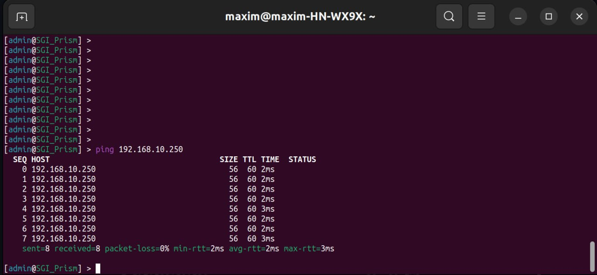

### University: [ITMO University](https://itmo.ru/ru/)

#### Faculty: [FICT](https://fict.itmo.ru)

#### Course: [Introduction in routing](https://github.com/itmo-ict-faculty/introduction-in-routing)

##### Year: 2022/2023

##### Group: K33202

##### Author: Konovalenko Maxim Pavlovich

##### Lab: Lab3

##### Date of create: 20.12.2022

##### Date of finished: 4.01.2023

***

# Отчёт по лабораторной работе №3 "Эмуляция распределенной корпоративной сети связи, настройка OSPF и MPLS, организация первого EoMPLS"

**Цель работы:** научиться использовать containerlab, получение практических навыков в настройке сети с VLAN'ами и методами работы с ними.

**Результаты работы:**

#### 1. Схема настраеваемой сети

<!--  -->

#### 2. Файл для развертывания тестовой сети yaml

```
name: netlab3
mgmt:
  network: statics
  ipv4_subnet: 172.20.20.0/24
topology:
  nodes:
    R01.SPB:
      kind: vr-ros
      image: vrnetlab/vr-routeros:6.47.9
      mgmt_ipv4: 172.20.20.2
    R01.MSK:
      kind: vr-ros
      image: vrnetlab/vr-routeros:6.47.9
      mgmt_ipv4: 172.20.20.3
    R01.HKI:
      kind: vr-ros
      image: vrnetlab/vr-routeros:6.47.9
      mgmt_ipv4: 172.20.20.4
    R01.LND:
      kind: vr-ros
      image: vrnetlab/vr-routeros:6.47.9
      mgmt_ipv4: 172.20.20.5
    R01.LBN:
      kind: vr-ros
      image: vrnetlab/vr-routeros:6.47.9
      mgmt_ipv4: 172.20.20.6
    R01.NY:
      kind: vr-ros
      image: vrnetlab/vr-routeros:6.47.9
      mgmt_ipv4: 172.20.20.7
    PC1:
      kind: vr-ros
      image: vrnetlab/vr-routeros:6.47.9
      mgmt_ipv4: 172.20.20.8
    SGI_Prism:
      kind: vr-ros
      image: vrnetlab/vr-routeros:6.47.9
      mgmt_ipv4: 172.20.20.9
      
  links: 
    - endpoints: ["R01.SPB:eth2", "R01.MSK:eth2"]
    - endpoints: ["R01.SPB:eth1", "R01.HKI:eth1"]
    - endpoints: ["R01.MSK:eth3", "R01.LBN:eth3"]
    - endpoints: ["R01.HKI:eth3", "R01.LND:eth3"]
    - endpoints: ["R01.HKI:eth2", "R01.LBN:eth2"]
    - endpoints: ["R01.LND:eth2", "R01.NY:eth2"]
    - endpoints: ["R01.LBN:eth1", "R01.NY:eth1"]
    - endpoints: ["R01.SPB:eth3", "PC1:eth3"]
    - endpoints: ["R01.NY:eth3", "SGI_Prism:eth3"]
```

#### 3. Тексты конфигурация для каждого сетевого устройства

**R01.SPB**


**R01.MSK**


**R01.HKI**


**R01.LND**

**R01.LBN**

**R01.NY**

**PC1**

**SGI_Prism**


#### 4. Результаты пингов




### Вывод

